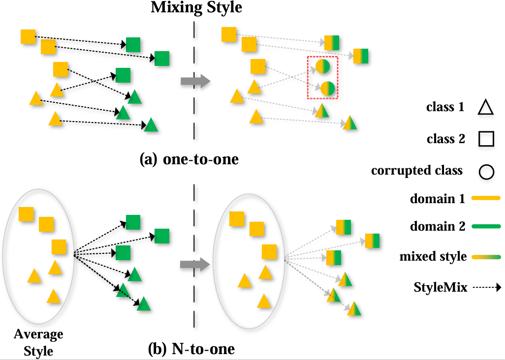

# Auto-StyleMixer: A Generalized Framework for Cross-domain Data Augmentation

## Abstract
Domain generalization (DG) aims to extend machine learning algorithms to unknown target domains with different data distributions from known source domains. Traditional processing techniques, such as the Fourier transform and normalization, are employed to extract style information for cross-domain data augmentation by confusing styles to enhance model generalization for content information. However, these methods tend to mix styles from one sample into another from a different domain (one-to-one) potentially corrupting class-relevant content information, especially in deeper layers. To mitigate this, a novel N-to-one method (StyleMixer) is proposed for executing more stable cross-domain data augmentation by averaging the style information of all samples from the same domain. Then, an adaptive strategy (AdaptiveAug) for cross-domain data augmentation is proposed to automatically learn the configuration of style mixing at each layer. Finally, our proposed generalized framework (Auto-StyleMixer) constructs Multiple Contrast Learning (MCL) loss specifically for cross-domain data augmentation to further reduce the domain gap. Extensive experiments are conducted to verify the effectiveness of the proposed method, and the results show that our method can achieve state-of-the-art performance on five DG benchmarks.
<p align="center">
    
</p>

---

Note that this project is built upon [DomainBed@3fe9d7](https://github.com/facebookresearch/DomainBed/tree/3fe9d7bb4bc14777a42b3a9be8dd887e709ec414) and [SWAD](https://github.com/khanrc/swad).


## Preparation

### Dependencies

```sh
pip install -r requirements.txt
```

### Datasets

```sh
python -m domainbed.scripts.download --data_dir=/data/
```

### Environments

Environment details used for our study.

```
Python: 3.7.13
PyTorch: 1.12.0+cu113
Torchvision: 0.13.0+cu113
CUDA: 11.3
CUDNN: 8.2
NumPy: 1.21.5
PIL: 9.0.1
```

## How to Run

`train_all.py` script conducts multiple leave-one-out cross-validations for all target domain.

```sh
python train_all.py exp_name --dataset PACS --data_dir /data/
```

- PACS

```
CUDA_VISIBLE_DEVICES=0 python train_all.py PACS --dataset PACS --deterministic \
--trial_seed 0 --checkpoint_freq 200 --steps 5000 --data_dir $data_dir --algorithm AutoSM \
--lr 3e-5 --backbone ResNet50 --MT True --AdaptiveAug True --allKL True --method N \
--mix_layers "['conv1','conv2_x','conv3_x','conv4_x','conv5_x']" --Mix_T 100 
```

`--MT`: Enable Mean Teacher \
`--AdaptiveAug`: Enable AdaptiveAug (`--AdaptiveP` and `--AdaptiveW` can also enable **Probability** and style mixing **Weights** for cross-domain data augmentation, respectively)\
`--allKL`: Enabling Multiple Contrast Learning (MCL) \
`--method`: Cross-domina data augmentation based on Normlization (N) or Fourier Transform (F) \
`--mix_layers`: Enable **StyleMixer** in which layers of the model to apply \
`--Mix_T`: Temperature parameter for AdaptiveAug

- VLCS

```
CUDA_VISIBLE_DEVICES=0 python train_all.py PACS --dataset PACS --deterministic \
--trial_seed 0 --checkpoint_freq 200 --steps 5000 --data_dir $data_dir --algorithm AutoSM \
--lr 1e-6 --backbone ResNet50 --MT True --AdaptiveAug True --allKL True --method N \
--mix_layers "['conv1','conv2_x','conv3_x','conv4_x','conv5_x']" --Mix_T 100 
```

- OfficeHome

```
CUDA_VISIBLE_DEVICES=0 python train_all.py PACS --dataset PACS --deterministic \
--trial_seed 0 --checkpoint_freq 200 --steps 5000 --data_dir $data_dir --algorithm AutoSM \
--lr 3e-5 --backbone ResNet50 --MT True --AdaptiveAug True --allKL True --method N \
--mix_layers "['conv1','conv2_x','conv3_x','conv4_x','conv5_x']" --Mix_T 100 
```

- TerraIncognita

```
CUDA_VISIBLE_DEVICES=0 python train_all.py PACS --dataset PACS --deterministic \
--trial_seed 0 --checkpoint_freq 200 --steps 5000 --data_dir $data_dir --algorithm AutoSM \
--lr 3e-5 --backbone ResNet50 --MT True --AdaptiveAug True --allKL True --method N \
--mix_layers "['conv1','conv2_x','conv3_x','conv4_x','conv5_x']" --Mix_T 100 
```

- DomainNet

```
CUDA_VISIBLE_DEVICES=0 python train_all.py PACS --dataset PACS --deterministic \
--trial_seed 0 --checkpoint_freq 1000 --steps 15000 --data_dir $data_dir --algorithm AutoSM \
--lr 3e-5 --backbone ResNet50 --MT True --AdaptiveAug True --allKL True --method N \
--mix_layers "['conv1','conv2_x','conv3_x','conv4_x','conv5_x']" --Mix_T 1000 
```